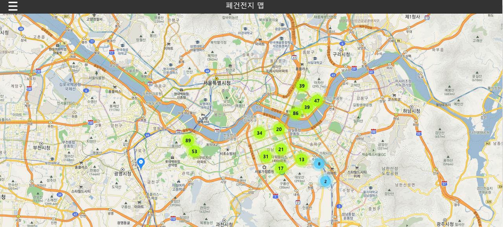
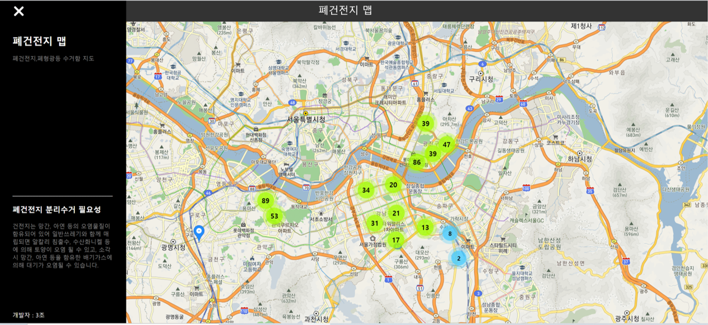

# 폐건전지 수거함 맵

## | 기획 의도
세계경제포럼(WEF)에서 2020년 세계를 위협하는 위험요인 중 top 5가 모두 환경문제에 관련된 만큼 환경문제에 대한 심각성이 나날이 강조되고 있습니다. 저희는 개인이 실천할 수 있는 환경문제 해결 책 중 분리수거에 대해 주목하였습니다. 그 중에서도 보급량과 폐기물 발생량이 늘어나고 있지만 3년간 국내 재활용률이 20%대에 머물고 있는, 폐전지류의 분리배출 필요성에 대해 알리고자 폐건전지 수거함 맵을 제작하게 되었습니다.

## | 개발 환경
 - 데이터베이스 : MySQL
 - 서버사이드언어: PHP
 - 클라이언트 사이드언어: HTML, CSS
 - 호스팅: Dothome(닷홈)

## | 폐건전지 수거함 맵
[링크] http://dbp3.dothome.co.kr/index.php
  ※ 마커의 갯수가 많으면 페이지 업로드가 너무 느려
부득이하게 500개로 제한했습니다.

-> 전체적으로 어떤 지역에 수거함이 얼마나 위치하고 있는지를 확인 할 수 있습니다.

-> 지도를 확대하면 수거함의 위치가 마커로 표시됩니다.

-> 사이드바를 클릭하면 간략히 폐건전지를 수거함에 버려야 하는 이유를 알 수 있습니다.

## | 역할분담
- 박민지: 닷홈 웹호스팅, 디비 구축
- 강한희: 닷홈 웹호스팅, 디비 구축, index.php ui 구현 및 마커 추가
- 정유나: index.php 클러스터 추가
- 홍민아: 데이터 수집 및 가공
- 유하영: 데이터 수집 및 가공, 소개 자료 작성

## | 보완해야 할 기능
 - 인근 수거함 검색 기능
 - 수거함 위치 부가 정보 마커 이벤트